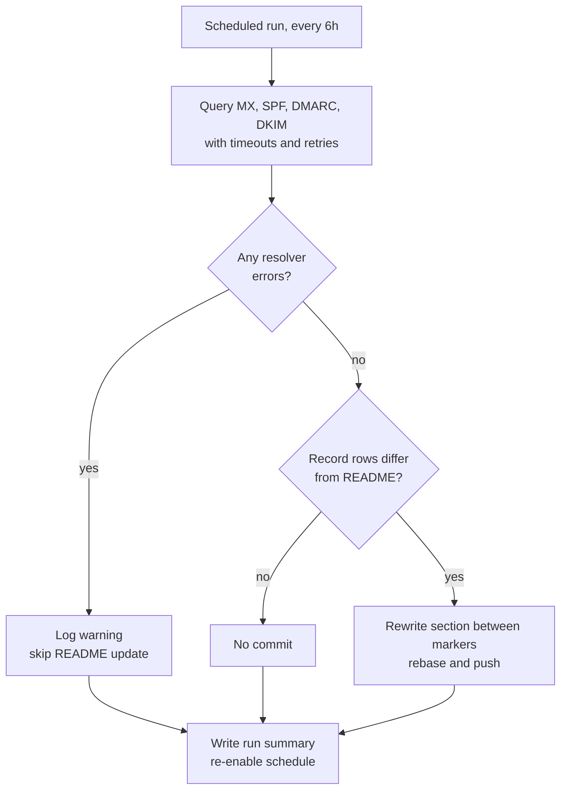

## Problem

Email authentication (SPF, DKIM, and DMARC) is set up once and then forgotten, until a DNS change or provider migration quietly breaks it and mail starts landing in spam. I wanted continuous, visible evidence that `jacksonasmith.com` stays correctly configured, published where people would actually see it: the live status table on my [GitHub profile](https://github.com/jackson-asmith).

## Existing state

The first version (January 2026) was a straightforward scheduled workflow. Every six hours it queried MX, SPF, DMARC, and common DKIM selectors, rendered a Markdown table with a timestamp, and wrote it into the profile README.

It worked, but it was noisy. The generated table included the current time, so every run produced a "change" and a commit. Between January and early April it made **about 350 commits**, and none of them reflected an actual DNS change.

## Constraints

* **Public by design.** Everything runs in a public repository against public DNS, so there's nothing sensitive to protect. But the output is public too, so wrong output is visible to anyone who looks.
* **No infrastructure.** No servers, no paid monitoring service. It uses only GitHub Actions and `dig`.
* **Unattended.** It had to keep working for months without anyone looking at it.

## Options considered

Each iteration came down to a decision about what the automation should do when things weren't clean:

| Decision point | Options | Chosen |
|---|---|---|
| When to commit | Every run · only when output differs · only when *records* differ | Only when record rows differ; the timestamp is excluded from the comparison |
| Resolver failure (timeout, SERVFAIL) | Treat it as "record missing" · fail the run · skip the update | Record the error and skip the README update |
| Schedule going dormant | Accept it · scheduled "keepalive" commits · re-enable the workflow through the API | Re-enable through the API on every run |

## Decision

**Compare records, not output.** The fix for the commit noise was to compare only the MX, SPF, DMARC, and DKIM rows against what's already in the README. A new timestamp alone never triggers a commit.

**A resolver error is not a missing record.** In the original version, a DNS timeout left the value empty, which the workflow then reported as "not configured". A transient network error would have been published as a misconfiguration. The hardened version tracks query failures separately and refuses to update the README when any query failed.

**Stay alive without fake activity.** GitHub disables scheduled workflows after 60 days without repository activity. Once the commit noise was fixed, the workflow was *designed* to go quiet, which meant it would eventually switch itself off. Rather than adding meaningless keepalive commits (the same noise I'd just removed), each run calls the Actions API to re-enable its own schedule.

## Safeguards

* `set -euo pipefail`, and scoring written so that a non-passing check can't accidentally abort the run
* Timeouts and bounded retries on every DNS query (`+time=5 +tries=3`)
* DMARC policy parsing anchored to the start of a tag, so a subdomain policy (`sp=reject`) can't be mistaken for the domain policy (`p=`)
* MX results sorted by priority so the reported primary is stable between runs
* The workflow fails loudly if the README's start/end markers are missing, instead of silently mangling the file
* A concurrency group plus rebase-before-push, so overlapping runs can't race each other
* Least-privilege permissions: `contents: write` for the README and `actions: write` for the keepalive, nothing else
* A run summary written on every execution, even on failure

## Outcome

* Commit noise went from **about 350 commits in three months to one** in the months since the fix: the single commit came when the table format itself changed.
* The public status can no longer be wrong because of a flaky resolver.
* The workflow keeps its own schedule alive without any manual intervention.

## Principles demonstrated

* **[Automation must reduce risk, not create it](/principles/#2-automation-must-reduce-risk-not-create-it):** the most important change wasn't a new feature. It was teaching the workflow the difference between "I couldn't check" and "it's broken".
* **[Reliability is a feature](/principles/#1-reliability-is-a-feature):** it runs unattended, fails safe, and keeps itself running.
* **[Testing comes before trust](/principles/#5-testing-comes-before-trust):** each fix came from checking what the automation actually did rather than assuming it worked. The next item below is where that's still unfinished.

## Lessons learned

* **Output that includes the time is never stable.** Any change detection has to compare the data, not the rendered output.
* **"Empty" is ambiguous.** Distinguish "absent" from "unknown" as early as possible, and let unknown block consequential actions.
* **Fixing one problem can create another.** Making the workflow quiet is what exposed the inactivity shutdown. It's worth asking what else depended on the old behavior.
* **What I'd do next:**
  * Move the parsing logic out of inline YAML into a script with unit tests covering SPF, DMARC, and resolver-failure cases.
  * Rename "Last updated" to "Last changed". The README timestamp now marks the last *change*, not the last *check*. The check itself is visible in each run's summary.
