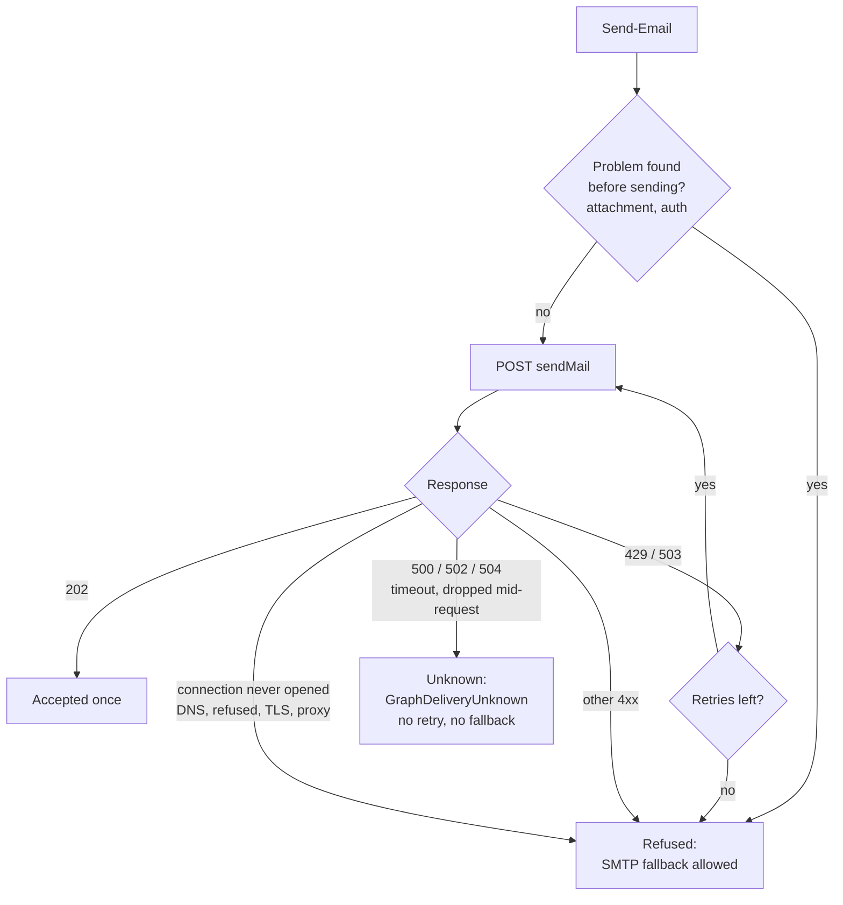

One gateway timeout could make [Keel](https://github.com/jackson-asmith/keel), my PowerShell library for unattended automation, send the same alert up to four times, and its 198 passing tests never noticed. The cause was standard advice: retry on server errors. If your code retries HTTP requests that aren't safe to repeat, it may have the same bug. Below is how I reproduced it, and the redesign that turned that timeout into exactly one request and an error telling the operator to check before resending.

## Problem

Unattended scripts need to tell people things: a sync failed, an account is about to expire, a certificate is due. In Keel, `keel.Http` wraps REST calls in bounded retries, and `keel.Mail` sends mail through Microsoft Graph, with SMTP as a fallback.

The goal is for Graph to accept each message exactly once. Missing an alert is bad, but so is getting it four times: repeated alerts teach people to ignore them, and a duplicated notice to an end user looks like a malfunction.

## Existing state

The first version followed the usual advice for resilient API calls. `Invoke-WithBoundedRetry` retried every transient status (408, 429, 500, 502, 503, 504) with exponential backoff and `Retry-After` support. On top of that, `Send-Email` fell back to SMTP whenever Graph failed. Its Pester suite ran 198 test cases, and all of them passed.

An AI-assisted code review flagged the problem. Graph's `sendMail` is a POST, and it isn't idempotent. A 504 from a gateway means the gateway stopped waiting, not that Graph did nothing.

I treat review findings as hypotheses until I can reproduce them, so the first step was a reproduction, not a fix. With Graph mocked to return 504, a single `Send-Email` call made **three Graph requests and then one SMTP send**. If Graph had accepted any of them, recipients could get the same message up to four times.

The same review found a quieter bug in the retry helper: output an attempt wrote before failing was emitted, then emitted again by the successful attempt.

## Constraints

* **No idempotency support.** [`sendMail`](https://learn.microsoft.com/en-us/graph/api/user-sendmail?view=graph-rest-1.0) returns `202 Accepted` with no response body, so there's no message ID to look up, and it documents no idempotency key. There's no cheap way to ask "did that one go through?"
* **Two runtimes.** It has to behave the same on Windows PowerShell 5.1 and PowerShell 7, which report network failures through different exception types.
* **Two sending paths.** With an access token, Keel calls Graph's REST API directly. Without one, it sends through the Graph PowerShell SDK, which has behavior of its own.
* **Keep the fallback useful.** SMTP fallback exists for real outages and misconfiguration. Removing it outright would make the library worse, not safer.

## Options considered

| Decision point | Options | Chosen |
|---|---|---|
| Which Graph failures to retry | All transient statuses · none · only statuses where Graph refused the request | Only 429 and 503 |
| When to fall back to SMTP | Any Graph failure · never · only when Graph provably didn't accept the message | Only on proven refusal |
| What to do when delivery is uncertain | Resend anyway · check Sent Items first · stop and report | Stop with a typed `GraphDeliveryUnknown` error |
| Output from a failed attempt | Stream it · buffer each attempt and return only the successful one | Buffer per attempt |
| The Graph SDK's own retries | Leave them on · send through REST only · turn them off for each send | Off for each send, caller's settings restored |

Checking Sent Items was the tempting middle option. I rejected it because it needs `Mail.Read` on the sending mailbox, it's slow, and it's still racy: the message can land after you look. Sending through REST only would have avoided the SDK's retries, but the SDK has no supported way to hand its access token to other code.

## Decision

**Resend only when Graph provably refused the message.** A 4xx means Graph rejected the request. A 503 means Graph was unavailable and didn't process it. A connection that never opened means the request never left the machine. In all of those cases, resending, through Graph or SMTP, can't create a duplicate. Everything else is treated as possibly delivered.

**"I don't know" is its own outcome.** When delivery is uncertain, `Send-Email` throws a `GraphDeliveryUnknown` error and sets `Exception.Data['KeelDeliveryState']` to `Unknown`. The message tells the operator to check message trace before resending. The job fails loudly instead of guessing.

**Make the safe choice available.** `Invoke-WithBoundedRetry` gained a `-RetryableStatusCode` parameter, so any caller making a non-idempotent request can narrow its retries the same way.

**Discard output from failed attempts.** The retry helper now returns only the successful attempt's output, trading streaming for no duplicates.

**Turn off the SDK's retries, not just Keel's.** The Graph PowerShell SDK retries 429, 503, and 504 on its own, so Keel sets the SDK's `MaxRetry` to 0 for each send and restores the caller's settings afterward. Those settings are process-wide: while a message is in flight, other Graph calls in the same PowerShell process also run without SDK retries. I accepted that for the length of one request rather than lose control of what gets resent.

The full reasoning, including a dated amendment for the SDK path, is in [ADR 0002](https://github.com/jackson-asmith/keel/blob/main/docs/adr/0002-no-resend-after-ambiguous-graph-failure.md).

## Safeguards

* Twice, to check that new tests actually guard a fix, I temporarily restored the old behavior: first the old retry list and output handling, later the direct SDK call. Each time, six tests failed.
* Anything the classifier doesn't recognize is treated as possibly delivered, so gaps in the classification fail safe. It's tested with the real exception types from both runtimes, and a connection reset mid-request is tested as *not* refused.

## Outcome

* On the direct REST path, the 504 scenario went from **three Graph requests plus one SMTP send to exactly one request** and a clear error.
* **The fix had a gap, and checking this write-up found it.** The SDK path goes through the SDK's own [retry handler](https://github.com/microsoftgraph/msgraph-sdk-design/blob/main/middleware/RetryHandler.md), which the mocked unit tests couldn't see. I confirmed it in the SDK source, then reproduced it against Microsoft.Graph.Authentication 2.40.0: one 504 reached the endpoint **4 times**. It also exposed a second bug: when the SDK gave up on a 429, its error used wording Keel couldn't parse, so a refused message lost its SMTP fallback. The integration test written from that reproduction failed 3 of 7 tests on the old code and passes all 7 with the fix.
* **The tests caught a bug in the fix, too.** My first version treated a failure to change the SDK's settings as "possibly delivered," which blocked fallback even though nothing had been sent. Those failures are now marked as not sent.
* The suite grew from 198 to 261 passing test cases, 7 of them against the real SDK. Every commit passes on its own, except the one that adds the SDK test ahead of its fix, which fails on purpose.
* Two ADRs record the decisions a reader would otherwise have to reverse-engineer: why configuration comes from `KEEL_` environment variables, and why the library never resends after an ambiguous failure, with an amendment for the SDK path.
* **Update, September 29: CI checked the other runtime, and it found a bug.** GitHub Actions now runs PSScriptAnalyzer and the Pester suite on PowerShell 7 across Linux, macOS, and Windows, plus Windows PowerShell 5.1. The first 5.1 run failed five tests. Most came from test assumptions that only held on PowerShell 7, but one exposed a real bug: 5.1's `Send-MailMessage` has no `-ReplyTo`, so SMTP delivery threw whenever a Reply-To was set. Keel now leaves Reply-To out on 5.1 and writes a warning naming the dropped addresses, so the message still goes out. The new tests for this brought the suite to 263 test cases. The failure classification passed on a real 5.1 host unchanged. A weekly job also runs the SDK integration tests against the latest Microsoft.Graph.Authentication, so a change in the SDK's retry behavior shows up before an upgrade.

## Principles demonstrated

* **[Automation must reduce risk, not create it](/principles/#2-automation-must-reduce-risk-not-create-it):** the fallback was added to make delivery more reliable, and under the wrong failure it made things worse. The fix narrowed what the automation is allowed to do on its own.
* **[Testing comes before trust](/principles/#5-testing-comes-before-trust):** 198 passing test cases didn't catch this, because none of them asked what a retry does to a non-idempotent request. The new tests were checked against the old behavior to prove they'd have failed.
* **[Documentation is engineering work](/principles/#6-documentation-is-engineering-work):** the README has a table showing which failures retry and which fall back, and the ADR explains the trade-offs, so the next engineer doesn't "fix" the missing fallback.

## Lessons learned

* **Retries are only as safe as the operation.** Standard advice like "retry on 5xx" assumes the request is idempotent. Check that before you add a retry, not after.
* **Passing tests prove what they test.** The original suite was thorough about retry timing and `Retry-After` parsing, and silent about duplicates. Coverage of the mechanism isn't coverage of the consequences.
* **A review finding is a hypothesis.** Every fix here started from a reproduction, and the claims about Graph's API were checked against Microsoft's documentation. That check is what found the SDK gap, and a reproduction against the real SDK is what confirmed it. The same tool wrote the fix and reviewed it, so its blind spots were correlated; checking against a primary source broke the tie.
* **Mocks can't show you what a dependency does on the wire.** Mocking the SDK made its retry handler invisible to more than 240 passing unit tests. A stub endpoint needed no tenant and found it in a minute.
* **"Unknown" keeps coming back.** In the [email alignment checker](/projects/email-alignment-checker/), the lesson was that an empty DNS answer isn't a missing record. Here it's that a timeout isn't a failure. Both times, the fix was to give "I couldn't tell" its own outcome and let it block the risky action.
* **What I'd do next:**
  * Confirm the 408 and 503 classifications against observed Graph behavior. Both currently rest on what the HTTP specification says those statuses mean.
  * Settle command naming (`Send-Email` versus a prefixed `Send-KeelMail`) in an ADR before a 1.0 release.
  * Support Graph upload sessions for attachments over 3 MB, instead of relying on SMTP for large files.
