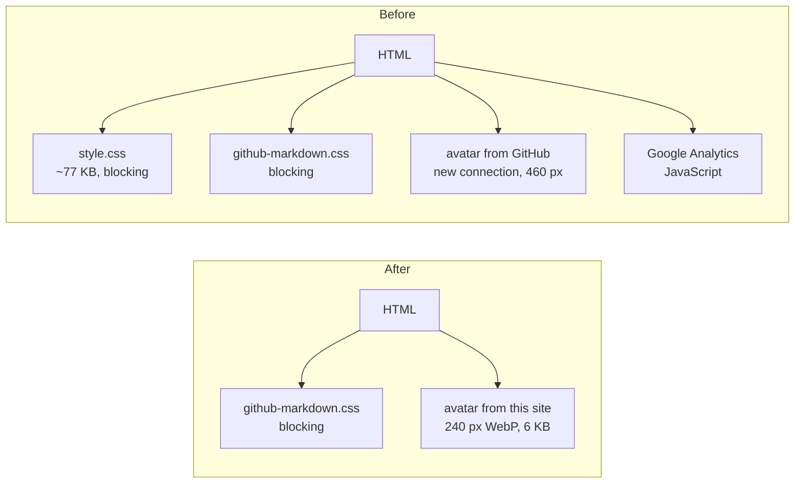

## Problem

This site scored 100 on Google's PageSpeed Insights desktop test but **86 on mobile**. The mobile test simulates a mid-range phone on a slow 4G connection, where every file that has to arrive before the page can draw costs far more than it does on desktop.

The JavaScript and layout metrics were already perfect: Total Blocking Time was 20 ms and Cumulative Layout Shift was 0. All of the lost points came from the paint metrics, which measure how soon the phone shows something: when the first text or image appears (First Contentful Paint), when the largest one does (Largest Contentful Paint), and how quickly the visible page fills in (Speed Index).

| Metric | Mobile result |
|---|---|
| First Contentful Paint | 2.6 s |
| Largest Contentful Paint | 3.6 s |
| Speed Index | 3.1 s |

So the question wasn't "what's slow?" but "what is the phone waiting for before it can show anything?"

## Existing state

The site is Jekyll on GitHub Pages, behind Cloudflare. The day before, I'd added dark mode by loading [`github-markdown-css`](https://github.com/sindresorhus/github-markdown-css) on top of the site's theme, `jekyll-theme-primer`. Its last release was in 2021, and it only styles light mode.

The home page made the phone fetch four things it didn't need, or didn't need in that form:

| Resource | Cost on a slow connection |
|---|---|
| Theme stylesheet (`style.css`) | About 77 KB (about 12 KB compressed) that has to download before anything renders. About 1,580 CSS rules, of which the site used 4 outside its content area. |
| `github-markdown-css` | About 6 KB compressed, also render-blocking. This one does the actual styling. |
| Avatar | A 460 px image displayed at 120 px, from `avatars.githubusercontent.com`. A different server means a new connection (DNS, TCP, TLS) before the download can start. |
| Google Analytics | The only JavaScript on the page. PageSpeed flagged 80 KiB of it as unused, plus 11 KiB of legacy JavaScript and a long main-thread task. |

## Constraints

* **No visual change.** This was a performance fix, not a redesign. Every page had to look exactly the same in light and dark mode, at every screen size.
* **GitHub Pages controls the build.** It pins the Jekyll and theme versions and sets response headers, including a 10-minute browser cache, so some fixes are out of reach from the repository.
* **No build pipeline.** I didn't want to add a bundler or a minification step to a personal site for a few kilobytes.

## Options considered

| Decision point | Options | Chosen |
|---|---|---|
| Google Analytics | Keep it · replace it with a lighter script · remove it | Remove it, and use Search Console for search data |
| Theme stylesheet | Keep it · strip unused rules · stop loading it | Stop loading it, and re-implement the 4 rules the site used |
| Avatar | Keep the GitHub URL · resize it in place · self-host it | Self-host a 240 px WebP, sized for 2× displays, with explicit dimensions |
| Remaining stylesheet | Leave it render-blocking · inline it into every page | Leave it. Inlining would mean a build step for a small gain. |

## Decision

**Let the data decide on analytics.** Google Analytics had been on the site for a while, but I rarely looked at it. Ninety days of data showed **31 sessions and 2 engaged sessions**. The 20 "direct" visits averaged about a second each with no engagement, which is mostly bots, link-preview fetchers, and me. Both engaged sessions came from Google search. That's a question Google Search Console answers better (which searches showed the site, and which got clicks), and it does so without putting any JavaScript on the page. Analytics was the largest script on the page and was measuring mostly noise.

**Remove the theme's stylesheet, not just its unused rules.** Once `github-markdown-css` was handling all the content styling, the theme was only providing page centering and spacing. Stripping unused rules would have meant maintaining a modified copy of a theme. Instead, the four rules the layout depended on (`box-sizing`, the 1012 px content column, and its padding and margins) are now three lines of CSS in the site's own stylesheet, with the theme's exact values.

**Serve the avatar like the page's main image, because it is one.** On mobile, the avatar is the first thing on the page. It's now a 240×240 WebP (6 KB) served from the site itself, sharp on high-density screens at its 120 px display size, with `width` and `height` set and `fetchpriority="high"`. The home page now makes no requests to other servers.

## Safeguards

The day before, the dark-mode change had shipped a bug: content was pinned to the left on wide screens. It had been checked by screenshot at one width, just above the content column's maximum, where the shift was only about 40 px and easy to miss. Removing a stylesheet is the same kind of change, so this one was verified differently:

* **Measured, not eyeballed.** A local preview of the site rendered every page through its real layouts and the real compiled theme CSS. A script then recorded the position, size, font size, line height, text color, and background of the main elements on each page, plus the page height, before and after the change: **728 measurements across 7 pages, 4 widths (390 to 2,560 px), and both color schemes. Zero differed.**
* **Pixel comparison.** Full-page screenshots before and after were **pixel-identical** on every page, in both color schemes.
* **Code highlighting checked separately.** No published page has a highlighted code block yet, so a throwaway test page with PowerShell, Bash, YAML, and diff samples was checked the same way.
* **Reasoning recorded with the change.** The commit and pull request list which PageSpeed finding each part addresses and how it was verified.

## Outcome

* **Mobile performance went from 86 to 99**, and desktop stayed at 100. Accessibility, Best Practices, and SEO all score 100 on mobile.

  | Metric (mobile) | Before | After |
  |---|---|---|
  | First Contentful Paint | 2.6 s | 1.5 s |
  | Largest Contentful Paint | 3.6 s | 1.5 s |
  | Speed Index | 3.1 s | 2.4 s |
  | Total Blocking Time | 20 ms | 0 ms |
  | Cumulative Layout Shift | 0 | 0 |

* **No visual change**, by measurement rather than by inspection.
* **The page carries less:** no analytics script, one stylesheet instead of two, and no requests to other servers on the home page. The only JavaScript left is the small email-obfuscation script Cloudflare injects, served from the site's own domain.
* **Search data without page JavaScript:** Google Search Console is set up, verified through the domain's DNS at Cloudflare, with the sitemap submitted. It covers the one traffic source that produced engaged visits, and reports which searches show the site and which lead to clicks.
* **Longer caching for static files:** GitHub Pages tells browsers to cache everything for 10 minutes, and that can't be changed from the repository. A Cloudflare cache rule now caches everything under `/assets/` for a month, at Cloudflare and in visitors' browsers. That's safe because the stylesheet URL changes with every deploy. HTML pages keep the short default, so edits still appear within minutes.

## Principles demonstrated

* **[Testing comes before trust](/principles/#5-testing-comes-before-trust):** "it looks the same" was replaced with 728 measurements and a pixel comparison, because the previous change had shown that looking at one screen size wasn't enough.
* **[Modernize incrementally](/principles/#3-modernize-incrementally):** the theme wasn't replaced in one move. Dark mode moved the content styling to a maintained stylesheet first, and only then did the theme's stylesheet become safe to drop. Each step was independently verified.

## Lessons learned

* **Measure what the user waits for, not what's easy to optimize.** Total Blocking Time and layout shift were already perfect. All the lost points were in the files the phone had to fetch before it could draw.
* **Installed isn't the same as useful.** Analytics cost every visitor a script download, and 90 days of its own data showed it wasn't informing any decisions.
* **A regression is a reason to change the test, not just the code.** The centering bug was fixed in three lines. The more durable fix was verifying the next change at several widths, by measurement.
* **Know where to stop.** The remaining warnings are the one stylesheet the page genuinely needs and Cloudflare's email-obfuscation script, which hides the `mailto:` address from scrapers in exchange for 11 KiB of JavaScript. Past 99, run-to-run variation is larger than anything left to gain.
* **What I'd do next:**
  * Run PageSpeed on the case study pages, which load Mermaid for diagrams and may behave differently from the home page.
